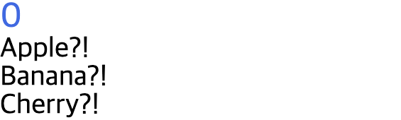

# Webpack Basic (Vue 3 Template)

이 프로젝트는 Vue 3와 Webpack 5를 기반으로 구성된 프론트엔드 개발 환경 템플릿입니다.



## 📚 학습 목표 (Learning Objectives)

이 프로젝트는 **Vue 3의 템플릿 문법(Template Syntax)**을 학습하고 실습하기 위해 만들어졌습니다.
주요 내용은 다음과 같습니다:

- **데이터 바인딩**: `v-bind`, `v-model`을 활용한 데이터 연결
- **이벤트 및 렌더링**: `v-on` 이벤트 처리, `v-if`/`v-for` 조건부 및 리스트 렌더링
- **컴포넌트 통신**: `props`와 `emit`을 활용한 부모-자식 간 데이터 전달

## � 기술 스택 (Tech Stack)

- **Framework**: Vue.js 3
- **Bundler**: Webpack 5
- **Compiler**: Babel (ES6+ 지원)
- **Style**: SCSS/SASS, PostCSS (Autoprefixer 적용)
- **Linter**: ESLint (Vue 플러그인 포함)

## 📦 설치 (Installation)

프로젝트 실행에 필요한 의존성 패키지를 설치합니다.

```bash
npm install
```

## 🚀 스크립트 (Scripts)

`package.json`에 정의된 주요 명령어입니다.

### 개발 서버 실행 (Development)

개발 모드로 웹팩 개발 서버를 실행합니다. HMR(Hot Module Replacement)이 활성화되어 있어 코드 수정 시 브라우저에 즉시 반영됩니다.

```bash
npm run dev
```

- **Host**: `localhost`
- **Port**: `8080`

### 프로덕션 빌드 (Production Build)

배포를 위해 최적화된 정적 파일을 생성합니다. 빌드 결과물은 `dist` 디렉토리에 저장되며, 이전 빌드 파일은 자동으로 삭제됩니다.

```bash
npm run build
```

### 린트 (Lint)

`.js` 및 `.vue` 파일의 코드 스타일과 오류를 검사하고 자동으로 수정합니다.

```bash
npm run lint
```

## ⚙️ 주요 설정 (Configuration)

- **경로 별칭 (Alias)**:
  - `~`: `src` 디렉토리 (예: `import ... from '~/components/...'`)
  - `assets`: `src/assets` 디렉토리
- **정적 파일 처리**:
  - `static` 디렉토리 내의 파일들은 빌드 시 결과물의 루트 경로로 그대로 복사됩니다.
  - 이미지 파일(`png`, `jpg`, `gif` 등)은 `file-loader`를 통해 처리됩니다.
- **브라우저 호환성**:
  - 전 세계 점유율 1% 이상, 최신 2개 버전의 브라우저를 지원하도록 설정되어 있습니다.
